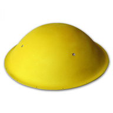
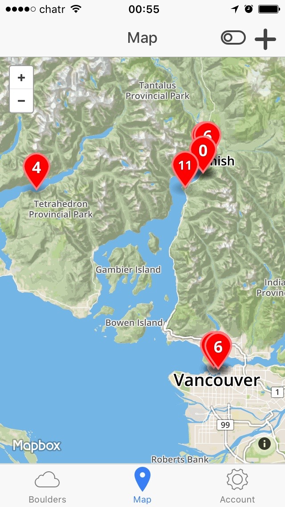
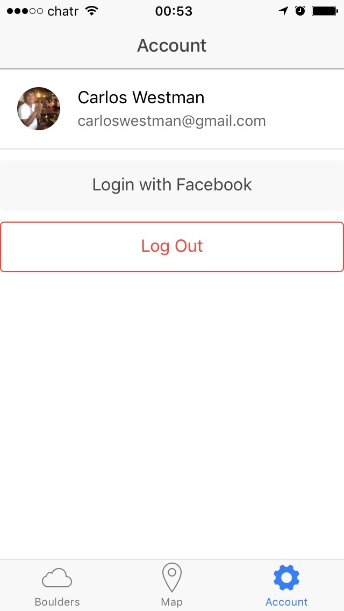

# Boulderer 
>Hybrid mobile application for sharing boulder problems within the climbing community 

I started Boulderer with two goals in mind, one social and the other one personal:

- <b>A social vision:</b> To provide an useful tool to the climbing community. Climbers can use their phones to discover, create and share boulder problems in the climbing gym and in the outdoors. Finding boulder problems in the Gym and the outdoors is a common problem between climbers. The information can be shared in different ways, but sometimes its also lost. The aplication should enable friends to share boulder problems with the help of a social network, easy to use, and free.
- <b>A challenge:</b> This is my first open source project where I can test and improve my skills designing and developing Mobile Application's technology. In this first round I have implemented the solution using an Ionic MEAN stack (MongoDB, Express, AngularJS, NodeJS), and Cordova to test the thevelopment of Hybrid Mobile Apps.

## Features

Features are focusing on essential functionality to make the application useful while keeping it simple. Current support with examples:

###Discover boulders in the outdoors

The easiest way to search for boulders is in the Map tab.
Double-tap markers to open the boulder.

	

###Discover Boulder Problems in climbing gym:
When you are in the climbing gym, there are too many boulders, and they are usually in the same place so the map won't be useful. The easiest way to browse through boulders is in the Boulder Tab. You can setup filters to only view the boulders you are interested in.

	

### Social Networking
To identify yourself in social network you need first to sign in with your Facebook user.

	

###Create your own boulders and share them:
 You can create your own boulder problems with your phone camera and share them with the community. Just take a picture, tap on the holds, and share.

	

## Roadmap

There is so much work to do, but it's exciting. Here there is a list with some of the roadmap activities:

1. Create the Github repository with a MVP version *[DONE]*
2. Code Refactoring *[It's ugly and not clean]*
 1. Cleaning sprint
 2. Improve accuracy of geolocation web service
 3. Test the frontend in Android
 4. Go into the Android and Apple stores.
3. Improve UX *[Designers needed]*
4. Develop the product Branding *[Designers needed]*
5. Develop a business model to maintain the service
6. Distribute

## Architecture

The architecture stack relies heavily on <b>JavaScript</b>. and lightweight frameworks aimed to develop scalable web solutions. I think performance of the backend is pretty solid. I am still wondering if I should follow a native approach for the frontends:

<table>
  <tr>
   <td>Back-end @AWS</td>
   <td>Web API: <b>NodeJS</b></td>
  </tr>
  <tr>
   <td></td>
   <td>Document storage: <b>MongoDB</b></td>
  </tr>
   <tr>
   <td></td>
   <td>Data Model: <b>Express</b></td>
  </tr>
  <tr>
    <td>Front-End @PhoneGap</td>
    <td>Framework: <b>AngularJS</b></td> 
  </tr>
    <tr>
    <td></td>
    <td>UX components: <b>Ionic</b></td> 
  </tr>
</table>

##API

A RESTful API has been implemented. At the moment there is not support for DELETE or UPDATE actions:

<table>
<tr>
<th>
Resource
</th>
<th>
Item
</th>
<th>
Description
</th>

<tr>
<td>
1
</td>
<td>
2
</td>
<td>
3
</td>
</tr>

<tr>
<td>
/api/boulders 
`GET`
</td>
<td>
Description
</td>
<td>
Gets a JSON array of boulders
</td>
</tr>

<tr>
<td>
</td>
<td>
Parameters
</td>
<td>
None
</td>
</tr>

<tr>
<td>
</td>
<td>
Response
</td>
<td>
A succesful response will generate a 200 http status. If an error ocurs, an http error status code will be generated. 
Succesful response Example: 
<pre style="json">
[  {
    "_id": "5805a71ea10ff6e414d37bdf",
    "updatedAt": "2016-10-18T04:37:49.830Z",
    "createdAt": "2016-10-18T04:37:49.830Z",
    "grade": 6,
    "accuracy": 1979,
    "latitude": 49.73310552199455,
    "longitude": -123.1416806450711,
    "pictureNaturalHeight": 4032,
    "pictureNaturalWidth": 3024,
    "pictureId": "5805a71ca10ff6e414d77bdc",
    "svgData": `"<circle id=\"0\" cx=\"60\" cy=\"376\" r=\"17\" style=\"stroke: rgb(255, 0, 0); stroke-width: 2px; fill: rgba(0, 0, 0, 0);\">"`,
    "svgViewPortHeight": 427,
    "svgViewPortWidth": 320,
    "ownerId": "carloswestman",
    "name": "Half Moon",
    "__v": 0
  }]
</pre>
</td>
</tr>

<tr>
<td>
/api/boulders 
`POST`
</td>
<td>
Description
</td>
<td>
Posts a boulder
</td>
</tr>

<tr>
<td>
</td>
<td>
Parameters
</td>
<td>
The body request should include the following parameters:

* <b>name:</b> Boulder name
* <b>grade:</b> Boulder grade
* <b>ownerID:</b> Id of the user
* <b>pictureID:</b> Id of the picture stored in the database
* <b>pirctureNaturalWidth:</b> Natural width of the picture
* <b>pictureNaturalHeight:</b> Natural height of the picture
* <b>svgData:</b> SVG data containing the sketch for the boulder
* <b>svgViewPortWidth:</b> svgViewPortWidth property when the boulder was created
* <b>svgViewPortHeight:</b> svgViewPortHeight property when the boluder was created
* <b>longitud:</b> GPS longitude
* <b>latitude:</b> GPS latitude
* <b>accuracy:</b> GPS accuracy
</td>
</tr>

<tr>
<td>
</td>
<td>
Response
</td>
<td>
A succesful response will generate a 200 http status. If an error ocurs, an http error status code will be generated. 
Succesful response Example: 
<pre style="json">
{ message: 'Boulder created, go for it and crush it man!' }
</pre>
</td>
</tr>

<table>

## Contribute

I am interested in working in teams. If you think that you can collaborate in the project with your skills, please send an email to <carloswestman@gmail.com>

## License

Carlos Westman – <carloswestman@gmail.com>

Distributed under the GNU APGL V3 license. See ``LICENSE`` for more information.

[https://github.com/carloswestman/boulderer](https://github.com/carloswestman/boulderer)

